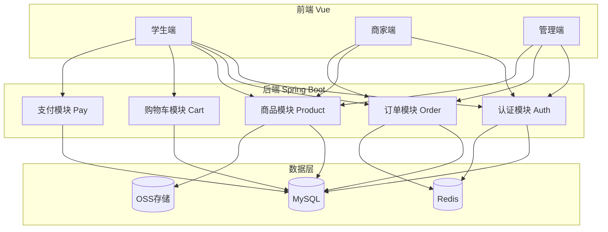
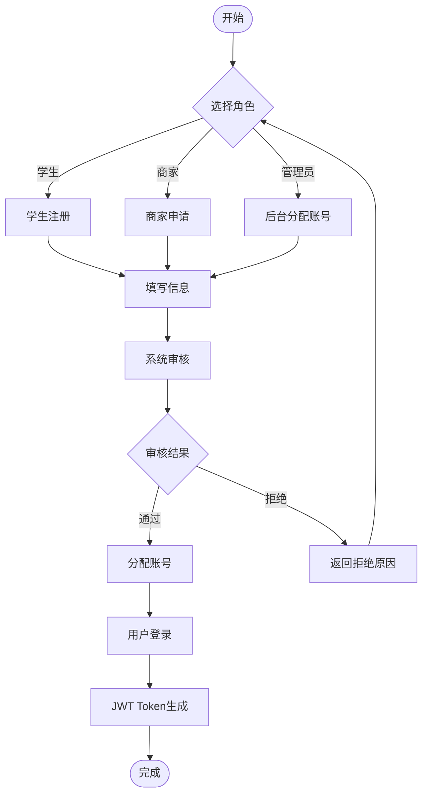
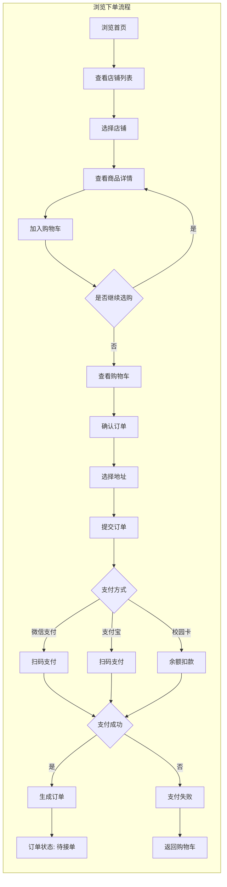
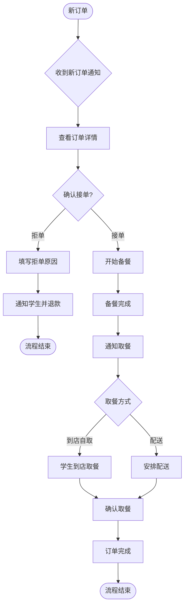
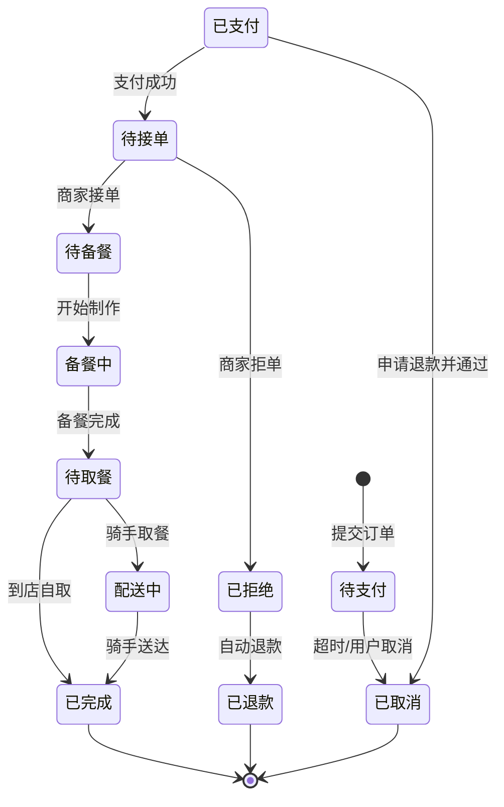
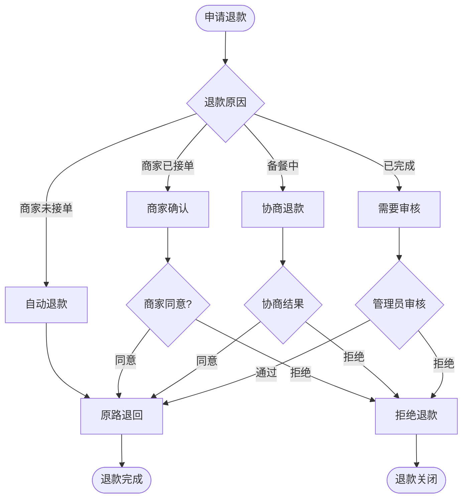
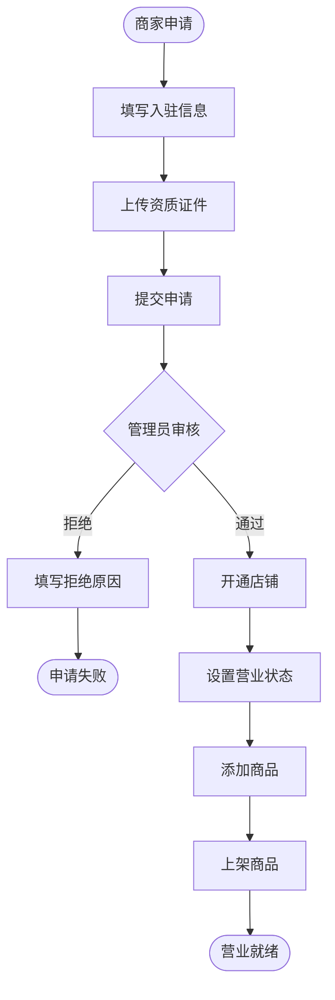
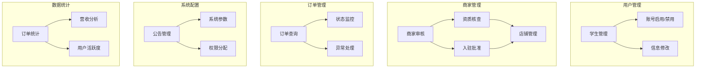
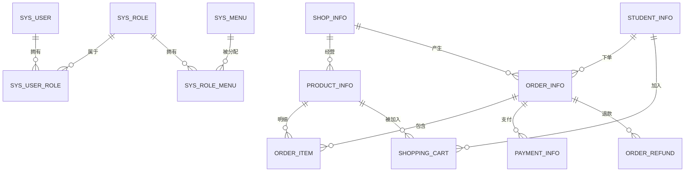
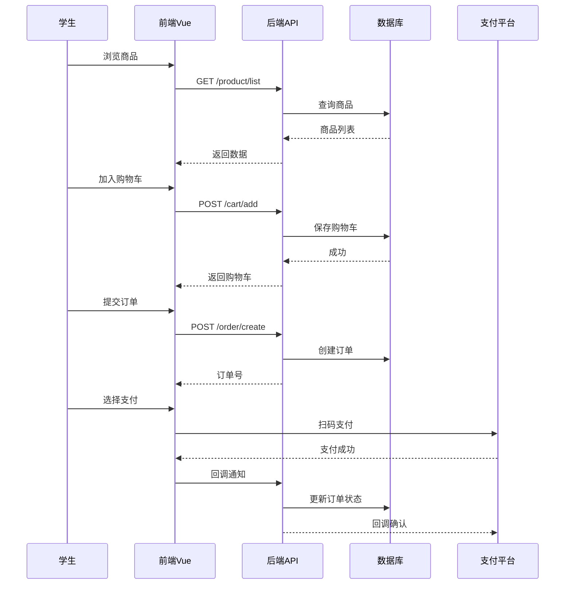

# 校园订餐系统流程图

> 可使用 Mermaid、Draw.io、PlantUML 等工具渲染

## 1. 系统整体架构

## 2. 用户认证流程

## 3. 学生订餐主流程

## 4. 商家处理订单流程

## 5. 订单状态流转

## 6. 退款流程

## 7. 商家入驻流程

## 8. 管理员功能模块

## 9. 数据库核心实体关系

## 10. 关键API接口流程

